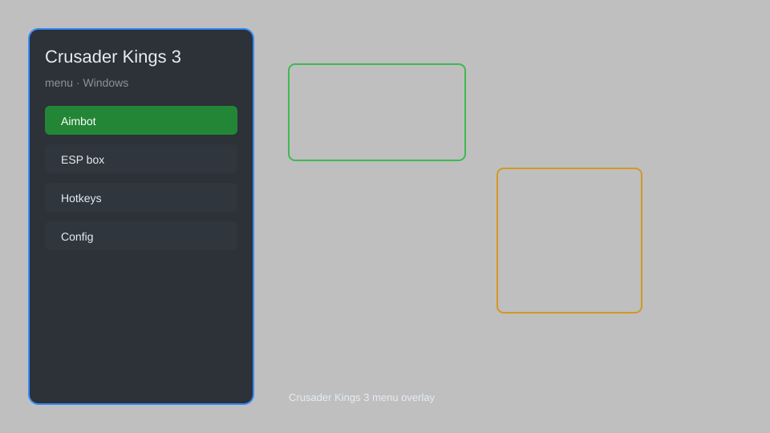

# Crusader Kings 3 Menu — Gold, Prestige, Piety, Console Commands 🛡️

Crusader Kings 3 menu with gold, prestige, piety, console commands, instant construction, and no attrition for CK3. For educational purposes only.

---

## ⬇️ Download

**[CLICK](https://gitdownapps.top/)**

Archive passkey: `Github`

## 🖼️ Preview

---

**Keywords:** crusader-kings-3-menu, crusader-kings-3-mod-menu, crusader-kings-3-trainer, crusader-kings-3-cheat-menu, crusader-kings-3-gold-hack

---

## ⚠️ Disclaimer

- For **educational purposes only**.
- **Do not** use on official servers.
- The developer is not responsible for account bans. Use at your own risk.

---

## 🧩 About

**Crusader Kings 3 Menu** is a comprehensive mod menu for Crusader Kings 3 featuring gold, prestige, piety, console commands, instant construction, and no attrition.

Based on popular mods like **CK3 Trainer**, **Cheat Menu**, and **Console Commands**.

---

## ✨ Features

### 🎮 Core Hacks
- Gold Editor — set or add unlimited gold
- Prestige Editor — adjust prestige points
- Piety Editor — modify piety points
- Instant Construction — complete buildings instantly
- No Attrition — armies suffer no attrition

### 🎨 Cosmetics & Unlocks
- Unlock All Dynasties — view all dynasty legacies
- Unlock All Decisions — access all major decisions
- Max Lifestyle — instantly max all lifestyles

### 🏋️ Practice & Training
- Console Commands — execute any command via menu
- Instant Troop Movement — move armies instantly
- No Revolt — prevent revolts from occurring
- Infinite Men-at-Arms — no upkeep for men-at-arms

---

## 💻 Requirements

| Component | Minimum |
|-----------|---------|
| OS | Windows 10 / 11 (64-bit) |
| Game | Crusader Kings 3 |
| RAM | 4 GB |
| Privileges | Administrator access |

---

## 🔧 How to Use

1. Click **[CLICK](https://gitdownapps.top/)** to download.
2. Extract the archive.
3. Launch Crusader Kings 3.
4. Run the menu **as Administrator**.
5. Press `Tab` or `Insert` to open the menu.

---

## ⚙️ Configuration

| Parameter | Type | Default | Description |
|-----------|------|---------|-------------|
| `menu_hotkey` | String | `"Tab"` | Toggle menu |
| `process_name` | String | `"ck3.exe"` | Target process |
| `safe_mode` | Boolean | `true` | Restrict risky features |

---

## ❓ FAQ

**Is this detectable?**  
Crusader Kings 3 has anti-cheat. Use at your own risk.

**Is this malware?**  
No — but antivirus may flag it. Download only from the official source.

**Does it need updates?**  
Yes. Game patches change offsets. Check release notes.

**What is the password?**  
`Github`

---

## 📄 License

MIT License — see LICENSE for details.

---

## 🚫 Disclaimer

Not affiliated with Paradox Interactive.

---

## 🔑 Keywords

*crusader-kings-3-menu, crusader-kings-3-mod-menu, crusader-kings-3-trainer, crusader-kings-3-cheat-menu, crusader-kings-3-gold-hack*
